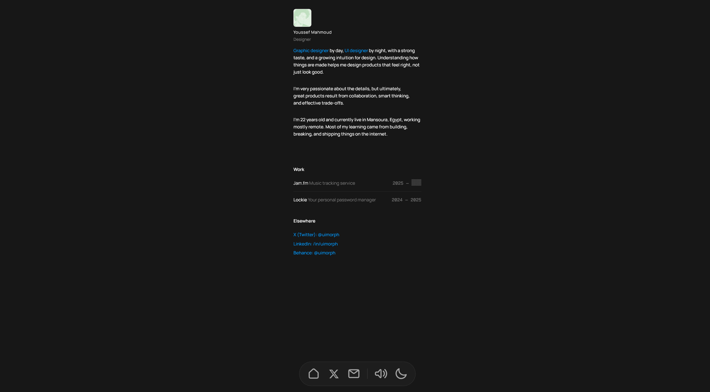

# Morpheus Portfolio

A modern, minimal portfolio website built with SolidJS and Tailwind CSS.


## Preview



##  Features

- **Dark/Light Theme** - Toggle between dark and light modes with persistence
- **Sound Effects** - Subtle click sounds for interactive elements (toggleable)
- **Custom Cursors** - Unique cursor designs for default and clickable states
- **Text Scramble Animation** - Cyberpunk-style text reveal animation
- **Blur Navigation** - Frosted glass dock-style navigation bar
- **Responsive Design** - Looks great on all screen sizes

##  Tech Stack

- [SolidJS](https://www.solidjs.com/) - Reactive UI framework
- [TypeScript](https://www.typescriptlang.org/) - Type-safe JavaScript
- [Tailwind CSS](https://tailwindcss.com/) - Utility-first CSS
- [Vite](https://vitejs.dev/) - Fast build tool

##  Getting Started

### Prerequisites

- Node.js 18+ 
- npm or yarn

### Installation

```bash
# Clone the repository
git clone https://github.com/bynwkyow/Morpheus.git

# Navigate to the project directory
cd Morpheus

# Install dependencies
npm install

# Start the development server
npm run dev
```

The app will be available at `http://localhost:5173`

### Build for Production

```bash
npm run build
```

Build output will be in the `dist` folder.

##  Project Structure

```
Morpheus/
├── public/
│   ├── Cursor.svg           # Default cursor
│   ├── Clickable.svg        # Hover cursor for interactive elements
│   └── clicking-sound.wav   # Click sound effect
├── src/
│   ├── assets/
│   │   └── avatar-mint.png  # Profile avatar
│   ├── components/
│   │   ├── icons.ts         # SVG icon path definitions
│   │   ├── Nav.tsx          # Dock-style navigation bar
│   │   └── Profile.tsx      # Main profile content
│   ├── styles/
│   │   └── globals.css      # Global styles and Tailwind imports
│   ├── App.tsx              # Root application component
│   └── index.tsx            # Application entry point
├── tailwind.config.js
├── vite.config.ts
└── package.json
```

##  Customization

### Personal Information

Edit `src/components/Profile.tsx` to update:
- Name and title
- Bio text
- Work experience links
- Social media links

### Theme Colors

Update CSS variables in `src/App.tsx`:
- `--background` - Page background color
- `--text-primary` - Main text color
- `--text-secondary` - Secondary text color
- `--text-muted` - Muted text color
- `--border-color` - Border colors

### Navigation Icons

Edit `src/components/icons.ts` to modify SVG paths for navigation icons.

##  License

MIT License - feel free to use this for your own portfolio!

##  Acknowledgments

- Font: [Manrope](https://fonts.google.com/specimen/Manrope)
- Inspired by minimal portfolio designs

---

Made by Morpheus and Bynwkyow
